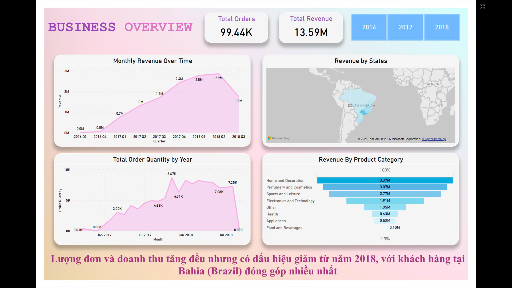
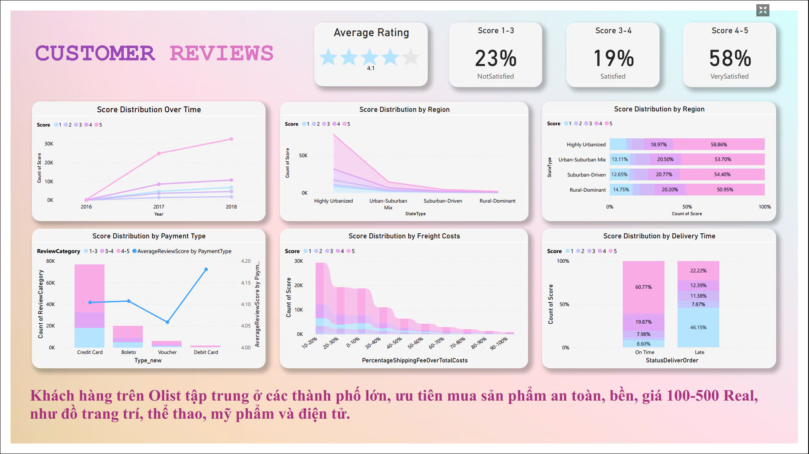
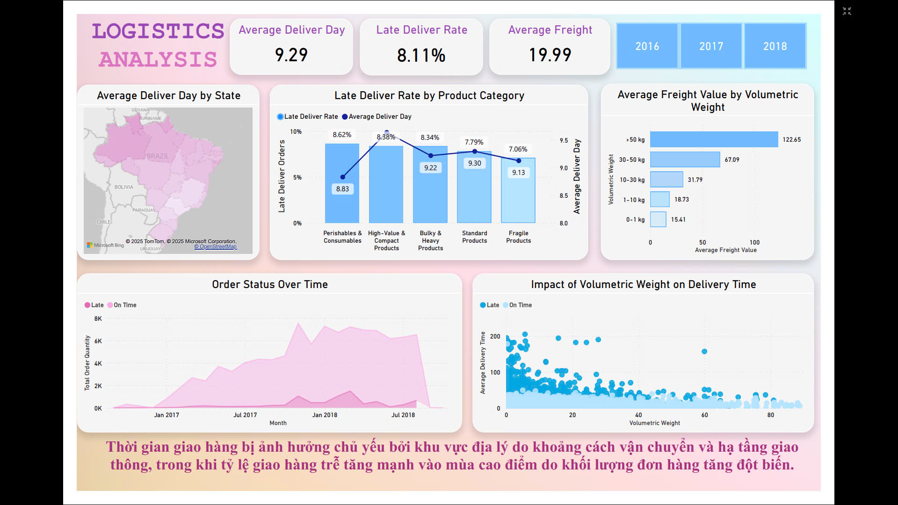
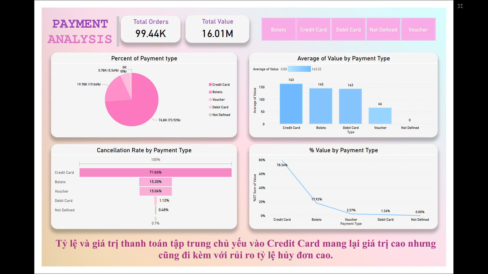

# **Brazilian E-Commerce Sales Analysis (Power BI Dashboard)**  

## **Project Objective**  
Analyze key metrics related to sales, customer behavior, logistics efficiency, and payment trends in the Brazilian e-commerce market. The objective is to identify actionable insights that can optimize operations, increase revenue, and enhance customer satisfaction.  

## **Dataset Used**  
- [Brazilian E-Commerce Dataset](https://www.kaggle.com/datasets/olistbr/brazilian-ecommerce/data) (Kaggle)  

## **Questions (KPIs)**  

### **Sales Performance & Customer Insights**  
- How do total sales and order volumes trend over time?  
- Which months and states contribute the most revenue?  
- What are the best-selling product categories?  
- How do customer demographics (location, spending habits) impact purchasing behavior?  

### **Customer Reviews & Satisfaction**  
- What factors influence customer satisfaction?  
- How do reviews vary by location, payment method, and delivery experience?  

### **Logistics & Delivery Efficiency**  
- What is the average delivery time, and how does it vary by region?  
- Which product categories experience the most delays?  
- How does delivery time impact customer satisfaction?  

### **Payment Behavior & Risks**  
- What are the most used payment methods?  
- How do payment methods impact transaction value and cancellation rates?  
- What strategies can reduce high-risk payment cancellations?  

---

## **Process**  

### **Data Cleaning & Preparation**  
- Verified and standardized dataset formats (dates, currency, categorical values).  
- Removed incomplete transactions and filtered relevant data.  

### **Data Transformation & Analysis**  
- Established relationships between key datasets (customers, orders, products, logistics).  
- Created calculated measures and KPIs using DAX in Power BI.  
- Applied advanced analytics to extract insights into trends, risks, and optimization opportunities.  

### **Dashboard Development**  
- Designed interactive visuals with slicers for real-time filtering.  
- Integrated KPIs into executive-level summaries for decision-making.  
- Applied geospatial analysis for regional insights.  

---

## **Dashboard Insights & Actions**  

### **1. Business Overview**  

.jpg)

#### **Analysis**  
- Sales and order volumes showed consistent growth until 2018, followed by a decline.  
- Bahia state contributed the highest revenue.  
- Best-selling categories: **Home decor, cosmetics, sports, and electronics**.  

#### **Actions**  
- Launch **targeted promotions and free shipping** to regain momentum in key states.  
- Investigate **2018 sales decline** and implement corrective measures.  

---

### **2. Customer Overview**  

#### **Analysis**  
- Customers are concentrated in **large cities**.  
- Preferred product price range: **100-500 BRL**.  

#### **Actions**  
- Expand in **urban markets** by promoting **affordable, high-quality products**.  
- Enhance **fast shipping and exclusive discounts** for customer retention.  

---

### **3. Customer Satisfaction**  
#### **Analysis**  
- Payment issues and delivery delays negatively affect ratings.  
- Lower satisfaction in **remote areas** due to logistics constraints.  

#### **Actions**  
- Improve **payment processing reliability**.  
- Develop **regional logistics strategies** for better delivery performance.  

---

### **4. Logistics Analysis**  

#### **Analysis**  
- **Average delivery time**: 9.29 days, with **8.11% late deliveries**.  
- **Peak seasons lead to higher delays** due to volume surges.  

#### **Actions**  
- **Expand storage facilities** in suburban areas.  
- Strengthen logistics capabilities **during peak seasons**.  

---

### **5. Payment Analysis**  

#### **Analysis**  
- **73.92% of transactions use credit cards**, but **71% of credit card transactions have high cancellation risks**.  
- Alternative payment methods (boleto, debit) have lower cancellation rates.  

#### **Actions**  
- **Reduce reliance on credit cards** by incentivizing alternative payments.  
- Implement **fraud detection and cancellation prevention measures**.  

---

## **Final Conclusion**  
To optimize operations and drive sustainable growth, the focus should be on:  
1. **Boosting sales through targeted promotions** in key markets.  
2. **Enhancing logistics efficiency** by expanding fulfillment capabilities.  
3. **Improving payment security and diversification** to reduce risk.  
4. **Addressing customer pain points** to increase retention and satisfaction.  

This Power BI dashboard provides a structured framework for data-driven decision-making, enabling management to refine strategies for increased efficiency and profitability.
