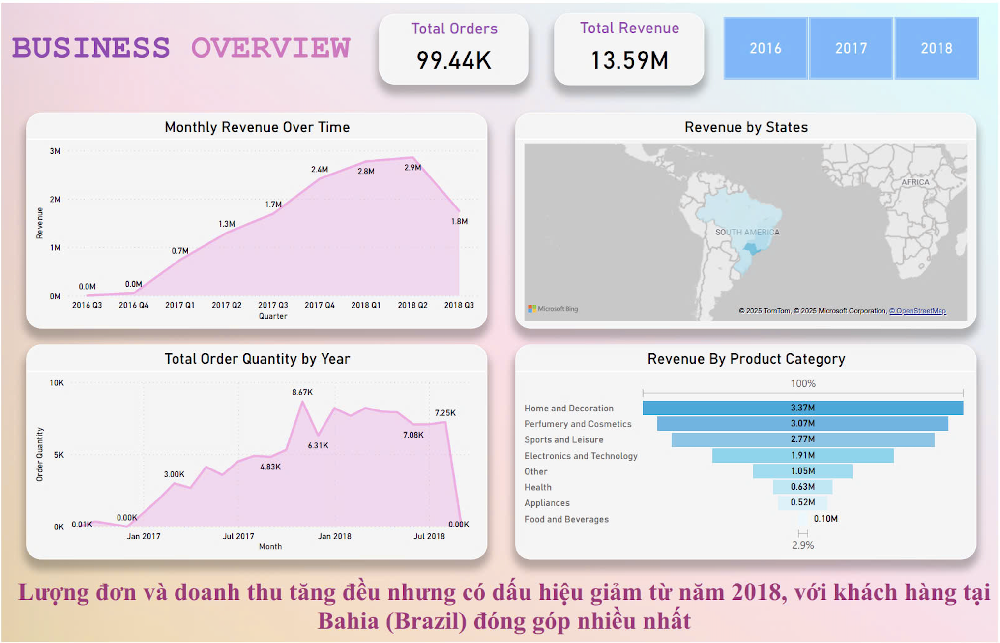
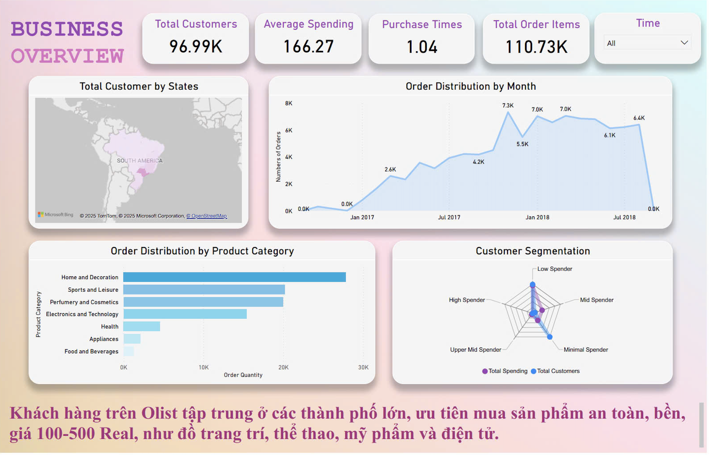
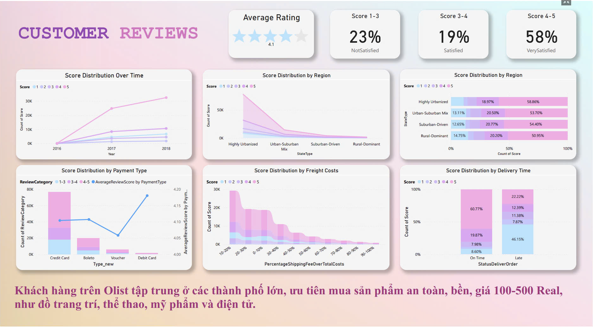
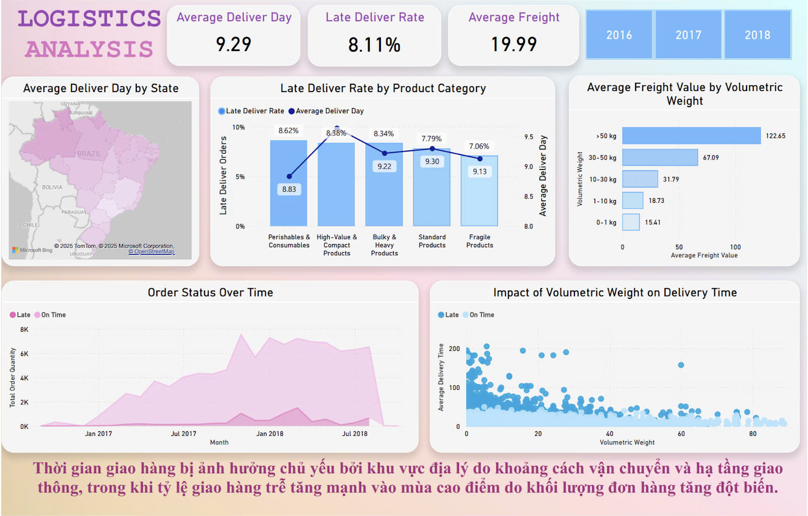
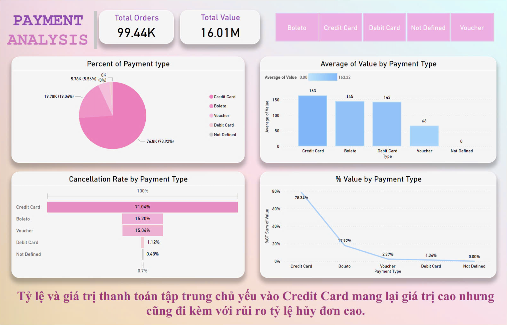

# **Brazilian E-Commerce Sales Analysis (Power BI Dashboard)**  

## **Project Overview**  
This Power BI dashboard analyzes key aspects of the **Brazilian e-commerce market**, focusing on **sales performance, customer behavior, logistics efficiency, and payment trends**. The goal is to uncover actionable insights to **optimize operations, increase revenue, and enhance customer satisfaction**.  

📥 **Download Dashboard**: [Click here](https://drive.google.com/drive/folders/1bxUdkodFfvGo4kZSSvtuc7zs2gwW-Ech?usp=drive_link)  

📊 **Dataset Used**: [Brazilian E-Commerce Dataset (Kaggle)](https://www.kaggle.com/datasets/olistbr/brazilian-ecommerce/data)  

---

## **Key Business Questions**  

### **1. Sales Performance & Customer Behavior**  
- How do total sales and order volumes trend over time?  
- Which months, states, and product categories generate the most revenue?  
- How do customer demographics (location, spending habits) affect purchasing behavior?  

### **2. Customer Satisfaction & Reviews**  
- What factors influence customer satisfaction?  
- How do reviews vary by location, payment method, and delivery experience?  

### **3. Logistics & Delivery Performance**  
- What is the average delivery time, and how does it vary by region?  
- Which product categories experience the most delays?  
- How does delivery time impact customer satisfaction?  

### **4. Payment Trends & Risks**  
- What are the most popular payment methods?  
- How do payment methods impact transaction value and cancellation rates?  
- What strategies can reduce high-risk payment cancellations?  

---

## **Project Workflow**  

### **1. Data Preparation & Cleaning**  
- Standardized data formats (dates, currency, categorical values).  
- Removed incomplete transactions and irrelevant records.  

### **2. Data Transformation & Analysis**  
- Established relationships between customers, orders, products, and logistics data.  
- Created calculated measures and KPIs using **DAX in Power BI**.  
- Applied analytics to identify trends, risks, and business opportunities.  

### **3. Dashboard Development**  
- Designed **interactive visuals** with slicers for dynamic filtering.  
- Built **executive-level summaries** for strategic decision-making.  
- Implemented **geospatial analysis** for location-based insights.  

---

## **Key Findings & Business Recommendations**  

### **1. Sales Overview**  
📊   
   

#### 🔍 **Insights**  
- Sales and order volumes grew steadily until **2018**, then declined.  
- **Bahia** state contributed the highest revenue.  
- **Top-selling categories**: Home decor, cosmetics, sports, and electronics.  

#### ✅ **Recommendations**  
✔️ Launch **targeted promotions & free shipping** in top-performing states.  
✔️ Investigate **2018 sales decline** and adjust marketing strategies.  

---

### **2. Customer Insights**  
📊   

#### 🔍 **Insights**  
- Customers are **mostly located in major cities**.  
- Preferred spending range: **100-500 BRL**.  

#### ✅ **Recommendations**  
✔️ Expand in **urban markets** with affordable, high-quality products.  
✔️ Offer **fast shipping & exclusive discounts** to improve retention.  

---

### **3. Customer Satisfaction**  

#### 🔍 **Insights**  
- **Payment issues & delivery delays** lower customer ratings.  
- Remote areas have lower satisfaction due to logistics constraints.  

#### ✅ **Recommendations**  
✔️ Improve **payment processing reliability**.  
✔️ Optimize **regional logistics** for better delivery performance.  

---

### **4. Logistics & Delivery Performance**  
📊   

#### 🔍 **Insights**  
- **Average delivery time**: **9.29 days**, with **8.11% late deliveries**.  
- **Peak seasons** see higher delays due to increased volume.  

#### ✅ **Recommendations**  
✔️ Expand **storage & fulfillment centers** in suburban areas.  
✔️ Strengthen **logistics network** for peak seasons.  

---

### **5. Payment Analysis**  
📊   

#### 🔍 **Insights**  
- **73.92% of transactions** use credit cards, but **71% of those have high cancellation risks**.  
- **Boleto & debit** transactions have lower cancellation rates.  

#### ✅ **Recommendations**  
✔️ Incentivize **alternative payment methods** to reduce credit card dependency.  
✔️ Implement **fraud detection & cancellation prevention strategies**.  

---

## **Final Conclusion & Next Steps**  
To **optimize e-commerce operations & boost revenue**, the business should focus on:  
**Targeted sales strategies** to increase revenue in key states.  
**Enhancing logistics efficiency** to reduce delivery delays.  
**Improving payment security & diversification** to lower risk.  
**Addressing customer pain points** to improve satisfaction & retention.  

This Power BI dashboard enables **data-driven decision-making**, helping businesses refine strategies for efficiency, profitability, and customer satisfaction.   

---

